# 表情包大作战（Meme Battle）


有点辣鸡的大学java课设，自己那时候花时间写的java小游戏。(A Simple game in java.)


## 一、   任务


运用Java课程所学知识，利用Java程序语言设计程序，程序应体现Java语言的自身特性，要求程序完整且功能较完整。


## 二、   需求分析


网络给人们生活带来便利的同时，也为人们带来了新的消遣方式：电子游戏。一个运行良好且具有良好的可延展性的电子游戏设计是很能反应学生的综合能力的。对于Java平台而言，图形界面的便捷设计更为创作者提供了良好的平台。电子游戏反应的是人们另一种方面上的精神追求，在虚拟世界中体验现实生活中体会不到的兴趣。


“表情包”是人们社会生活的产物，反应了人们情绪性的变化，在游戏中添加“表情包”的游戏元素，可以让玩家得到不同的“恶搞性”兴趣。


游戏中分为多种关卡设计，提供不同的游戏挑战难度，使游戏的耐玩性得到提高；又因为是“表情包”作为人物主角和怪物，还有一定的情绪过度和推动，使得玩家对游戏的“亲切感”提升。


在游戏中加入些许细节，满足玩家对游戏世界探索的需要，例如动作切换，难度的突然调节，打破人们对游戏的常规认知，更能让玩家留下深刻印象。


游戏中有些小细节：


* 1.按住移动键，人物移动速度是可以逐渐加快的；


* 2.人物跳跃的高度是随机的，故意这样设计增加BOSS关难度；


* 3.人物每攻击一次，可以变换图案（换装）；


* 4.怪物每被攻击一次，会变换图案（会切换到下一个表情），知道被攻击三次后，记作击败；


* 5.有特殊怪物，击杀了可以获得三分；


* 6.BOSS设计了两个攻击方式，一个是弹幕式的攻击（由BOSS为中心随机发射弹幕：Boss Skill.png），一个是半屏的攻击（随机在某个位置产生攻击范围约半屏的喷射：Boss Skill.gif），但是……实现效果不佳，因为判定方式是和人物的坐标相对应的，人物图像会有擦边不算击伤，有时会因为是png图像，碰到人物图像轮廓但没碰到人物轮廓却被判了击伤……


* 7.最后的彩蛋（Pixiv.gif）没加进去，时间太赶了，肝爆了……


## 三、   总体设计


《表情包大作战》小游戏可以使玩家操作游戏人物，击败表情包化生的普通怪物和BOSS怪物。游戏设计主要分为界面设计，提示窗口设计，怪物设计，人物设计及游戏机制设计。


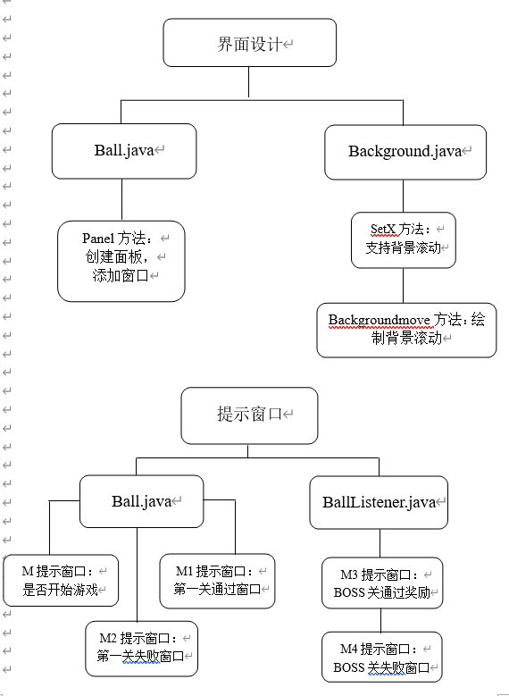


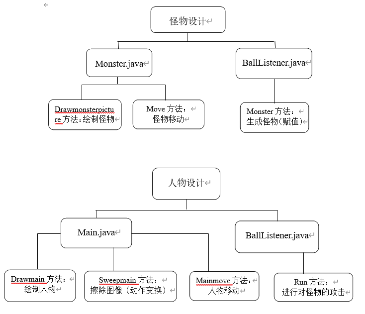


## 四、   详细设计


### 1.   界面设计（Ball.java & Background.java）：


面板类创建界面：

```
public class Ball extends JPanel {
	/**
	 * 
	 */
	private static final long serialVersionUID = 1L;
	//serialVersionUID作用是序列化时保持版本的兼容性，即在版本升级时反序列化仍保持对象的唯一性。
	private Graphics g;
	
	Dimension ScreenSize = Toolkit.getDefaultToolkit().getScreenSize();
	/*Dimension 类封装单个对象中组件的宽度和高度（精确到整数）。
	该类与组件的某个属性关联。由 Component 类和LayoutManager 接口定义的一些方法将返回 Dimension 对象。*/
	
	public void Panel() {     //窗口画板
		JFrame jf = new JFrame();
		jf.setSize(ScreenSize.width,ScreenSize.height);
		jf.setTitle("表情包作战？！");
		
		jf.setDefaultCloseOperation(3);
		/*setDefaultCloseOperation(int operation)：设置用户在此窗体上发起 "close" 时默认执行的操作。
		 * 为“0”或DO_NOTHING_ON_CLOSE：不执行任何操作；
		 * 为“1”或HIDE_ON_CLOSE：调用任意已注册的 WindowListener 对象后自动隐藏该窗体。
		 * 为“2”或DISPOSE_ON_CLOSE：调用任意已注册 WindowListener 的对象后自动隐藏并释放该窗体。
		 为“3”EXIT_ON_CLOSE：使用 System exit 方法退出应用程序。*/
		
		jf.setLocationRelativeTo(null);     //设置窗体相对指定组件的位置
		jf.getContentPane().setBackground(Color.BLUE);
		//JFrame 有一个 Content Pane，窗口能显示的所有组件都是添加在这个 Content Pane 中。
		jf.setResizable(false);     //Frame不可调节大小
		jf.add(this,BorderLayout.CENTER);     //将当前类的对象实例加到frame的中间位置。
		jf.setVisible(true);
```


背景类绘制背景；当人物贴近创窗口边缘时，提供背景的滚动：

```
public class Background implements ImageObserver {
	private int x;     //背景起始坐标
	private int y;
	private Graphics g;
	private Dimension ScreenSize = Toolkit.getDefaultToolkit().getScreenSize();
	private ImageIcon backgroundpicture = new ImageIcon("G:\\Java World!\\Meme Battle\\source material\\背景\\0.png");//背景图
	
	public Background(int x,int y,Graphics g) {
		this.x = x;
		this.y = y;
		this.g = g;
	}
	
	public void setX(int x) {     //背景滚动的传递距离
		this.x = x;
	}
	
	public void Backgroundmove() {
		System.out.println(x + " ");
		g.drawImage(backgroundpicture.getImage(),x,y,ScreenSize.width,ScreenSize.height,null);
		g.drawImage(backgroundpicture.getImage(),x + ScreenSize.width,y,ScreenSize.width,ScreenSize.height,null);
	}
	
	@Override
	public boolean imageUpdate(Image img,int infoflags,int x,int y,int wideth,int heigth) {
		return false;
	}
}
```


### 2.   提示窗口设计(Ball.java & BallListener.java):


开始游戏前的说明界面：

```
Object[] options ={ "开始无聊的时光", "不选择浪费生命" };  //自定义按钮上的文字
		int m = JOptionPane.showOptionDialog(null, "这里是《表情包大作战》，是一个超级简陋滴游戏\n" + 
		"A：向左移动     D：向右移动     J：向左攻击     K：向右攻击\n" + "也许W和S也有什么用处？Σ( ° △ °|||)︴\n" + 
				"请按空格开始游戏吧！（才不会告诉你回车可以重新开始）", "这是个普通的介绍Orz",
				JOptionPane.YES_NO_OPTION, JOptionPane.QUESTION_MESSAGE, null, options, options[0]);
		
		if(m == 1) {     //直接退出游戏
			System.exit(0);
		}
```


第一通过/失败的界面：

```
if(main.getscore() >= 20 ) {
			Object[] options ={ "继续无聊的时光", "不选择浪费生命" };  //自定义按钮上的文字
			m1 = JOptionPane.showOptionDialog(null, "恭喜通过第一关", "QWQ",
					JOptionPane.YES_NO_OPTION, JOptionPane.QUESTION_MESSAGE, null, options, options[0]);
			if(m1 == 1) {
				System.exit(0);
			}
			//next = true;
		}

if(list.size() + list1.size() + list2.size() + list3.size() >= 20) {
			Object[] options ={ "继续无聊的时光", "不选择浪费生命" };  //自定义按钮上的文字
			m2 = JOptionPane.showOptionDialog(null, "灰常抱歉，你没能战胜表情包","诶呀，表情包太多啦！QAQ",
					JOptionPane.YES_NO_OPTION, JOptionPane.QUESTION_MESSAGE, null, options, options[0]);
			if(m2 == 1) {
				System.exit(0);
			}else {
				for(int i = 0;i < list.size();i++) {     
					list.remove(i);
				}
				for(int i = 0;i < list1.size();i++) {     
					list1.remove(i);
				}
				for(int i = 0;i < list2.size();i++) {     
					list2.remove(i);
				}
				for(int i = 0;i < list3.size();i++) {     
					list3.remove(i);
				}
				main.setScore(0);
				xstop = false;
				stop = true;
			}
		}
```


Boss关通过/失败的界面：

```
if(list4.size() == 0) {
			Object[] options ={ "→小彩蛋←", "不选择浪费生命" };  //自定义按钮上的文字
			m3 = JOptionPane.showOptionDialog(null, "tql wsl","QWQ",
					JOptionPane.YES_NO_OPTION, JOptionPane.QUESTION_MESSAGE, null, options, options[0]);
			if(m3 == 1) {
				System.exit(0);
			}
		}

if((boss.a == main.getx())&&(boss.b == main.gety())) {
			Object[] options ={ "继续无聊时光", "不选择浪费生命" };  //自定义按钮上的文字
			m4 = JOptionPane.showOptionDialog(null, "你被滑稽击败啦","QAQ",
					JOptionPane.YES_NO_OPTION, JOptionPane.QUESTION_MESSAGE, null, options, options[0]);
			if(m4 == 1) {
				System.exit(0);
			}else {
				for(int i = 0;i < list4.size();i++) {     //重新开始
					list4.remove(i);
				}
				xstop = false;
				stop = true;
			}
		}
```


### 3.   怪物设计（Monster.java & BallListener.java）:


怪物的绘制：

```
public class Monster implements ImageObserver {
	private int x,y,xspeed;     //怪物出现的坐标及移动速度
	private int monsterwidth = 90 * 2,monsterheigth = 90 * 2;
	private int attacknum1,attacknum2,attacknum3;
	private Graphics g;
	private ImageIcon monsterpicture = new ImageIcon("G:\\Java World!\\Meme Battle\\source material\\北方\\看我脸色行事\\0.gif");
	private ImageIcon monsterpicture1 = new ImageIcon("G:\\Java World!\\Meme Battle\\source material\\北方\\而你们呢\\0.jpg");
	private ImageIcon monsterpicture2 = new ImageIcon("G:\\Java World!\\Meme Battle\\source material\\北方\\而你们呢\\1.jpg");
	private ImageIcon monsterpicture3 = new ImageIcon("G:\\Java World!\\Meme Battle\\source material\\北方\\而你们呢\\2.jpg");
	private ImageIcon monsterpicture4 = new ImageIcon("G:\\Java World!\\Meme Battle\\source material\\北方\\你走\\0.jpg");
	private ImageIcon monsterpicture5 = new ImageIcon("G:\\Java World!\\Meme Battle\\source material\\北方\\你走\\1.jpg");
	private ImageIcon monsterpicture6 = new ImageIcon("G:\\Java World!\\Meme Battle\\source material\\北方\\你走\\2.jpg");
	private ImageIcon monsterpicture7 = new ImageIcon("G:\\Java World!\\Meme Battle\\source material\\北方\\是在下输了\\0.jpg");
	private ImageIcon monsterpicture8 = new ImageIcon("G:\\Java World!\\Meme Battle\\source material\\北方\\是在下输了\\1.jpg");
	private ImageIcon monsterpicture9 = new ImageIcon("G:\\Java World!\\Meme Battle\\source material\\北方\\是在下输了\\2.jpg");
	private ArrayList<Monster> list;
	
	public int getX() {     //判断人物与怪物距离的传递
		return x;
	}
	public void setAttacknum1(int attacknum1) {
		this.attacknum1 = attacknum1;
	}
	public void setAttacknum2(int attacknum2) {
		this.attacknum2 = attacknum2;
	}
	public void setAttacknum3(int attacknum3) {
		this.attacknum3 = attacknum3;
	}
	
	public Monster(int x,int y,int xspeed,Graphics g,ArrayList<Monster> list) {
		this.x = x;
		this.y = y;
		this.xspeed = xspeed;
		this.g = g;
		this.list = list;
	}
	public void Drawmonsterpicture(Graphics g) {     //绘制怪物图像
		g.drawImage(monsterpicture.getImage(),x,y,monsterwidth,monsterheigth,null);//看看是否要指定为this
	}
	public void Drawmonsterpicture1(Graphics g) {     //绘制怪物图像
		g.drawImage(monsterpicture1.getImage(),x,y,monsterwidth,monsterheigth,null);//看看是否要指定为this
		if(attacknum1 == 1) {
			g.drawImage(monsterpicture2.getImage(),x,y,monsterwidth,monsterheigth,null);
		}else if(attacknum1 == 2) {
			g.drawImage(monsterpicture3.getImage(),x,y,monsterwidth,monsterheigth,null);
		}
	}
	public void Drawmonsterpicture2(Graphics g) {     //绘制怪物图像
		g.drawImage(monsterpicture4.getImage(),x,y,monsterwidth,monsterheigth,null);//看看是否要指定为this
		if(attacknum2 == 1) {
			g.drawImage(monsterpicture5.getImage(),x,y,monsterwidth,monsterheigth,null);
		}else if(attacknum2 == 2) {
			g.drawImage(monsterpicture6.getImage(),x,y,monsterwidth,monsterheigth,null);
		}
	}
	public void Drawmonsterpicture3(Graphics g) {     //绘制怪物图像
		g.drawImage(monsterpicture7.getImage(),x,y,monsterwidth,monsterheigth,null);//看看是否要指定为this
		if(attacknum3 == 1) {
			g.drawImage(monsterpicture8.getImage(),x,y,monsterwidth,monsterheigth,null);
		}else if(attacknum3 == 2) {
			g.drawImage(monsterpicture9.getImage(),x,y,monsterwidth,monsterheigth,null);
		}
	}
	public void Move() {
		x += xspeed;     //加速
		if(x - 25 <= 0 || x >= 1720) {     //碰到界面边界返回移动
			xspeed = -xspeed;
		}
	}
	
	@Override
	public boolean imageUpdate(Image img,int infoflags,int x,int y,int wideth,int heigth) {
		return false;
	}//infoflags - 下列标志按位 OR 运算后的结果：WIDTH、HEIGHT、PROPERTIES、SOMEBITS、FRAMEBITS、ALLBITS、ERROR、ABORT。
}//如果 infoflags 指示已完全加载了图像，则返回 false；否则返回 true。
```


怪物参数的赋值；并且将怪物为单元存入数组：

```
public void monster(int x) {     //获取MonsterRun传递来的随机速度和水平坐标
		Monster monster = new Monster(x,500,random.nextInt(20) - 10,g,list);
		Monster monster1 = new Monster(x,500,random.nextInt(20) - 10,g,list1);
		Monster monster2 = new Monster(x,500,random.nextInt(20) - 10,g,list2);
		Monster monster3 = new Monster(x,500,random.nextInt(20) - 10,g,list3);
		list.add(monster);
		list1.add(monster1);
		list2.add(monster2);
		list3.add(monster3);
		//monster.Drawmonsterpicture(g);
		//monster.Move();
```


### 4.   人物设计（Main.java）:


人物的绘制及动作实现：

```
public class Main implements ImageObserver {
	private int picture = 0;
	private int x;
	private int y;
	private int xspeed;
	private int upheigth;
	private int attackwidth = 75 *2;
	private int attackheigth = 75 *2;
	private int runwidth = 75* 2,runheigth = 75 * 2;
	private int standwidth = 75 * 2,standheigth = 75 * 2;
	private int attacknum,attacknum1,attacknum2,attacknum3 = 0;
	private int m1;
	private Graphics g;
	private ArrayList<Monster> list;
	private ArrayList<Monster> list1;
	private ArrayList<Monster> list2;
	private ArrayList<Monster> list3;
	//private ArrayList<Boss> list4;
	private int score = 0;
	private BallListener bl;
	private Background backgroundpicture;
	private boolean right;
	private boolean left;
	private boolean up;
	private boolean down;
	private boolean j;
	private boolean k;
	private int backgroundpicturex = -800;     //看图片大小
	private Random random = new Random();
	private int l = random.nextInt(67);
	ImageIcon im1 = new ImageIcon("G:\\Java World!\\Meme Battle\\source material\\POP\\右移动.gif");//主角站立图片路径
	ImageIcon []ima2 = new ImageIcon[68];//主角右移图片路径
	ImageIcon []ima3 = new ImageIcon[68];//主角左移图片路径
	ImageIcon im4 = new ImageIcon("G:\\Java World!\\Meme Battle\\source material\\POP\\右移动.gif");
	ImageIcon im5 = new ImageIcon("G:\\Java World!\\Meme Battle\\source material\\POP\\当场去世.gif");
	ImageIcon [] ima4 = new ImageIcon[13];//右图片数组
	ImageIcon [] ima5 = new ImageIcon[13];//左图片数组
	
	{
		for(int i = 0;i <= 67;i++) {
			ima2[i] = new ImageIcon("G:\\Java World!\\Meme Battle\\source material\\POP\\→\\登场 " + i + ".png");
		}
		for(int i = 0;i <= 67;i++) {
			ima3[i] = new ImageIcon("G:\\Java World!\\Meme Battle\\source material\\POP\\←\\登场 " + i + ".png");
		}
		for(int i = 0;i <= 12;i++) {
			ima4[i] = new ImageIcon("G:\\Java World!\\Meme Battle\\source material\\PIPI\\→\\生气了嘛 " + i + ".png");//右打斗图附入
		}
		for(int i = 0;i <= 12;i++) {
			ima5[i] = new ImageIcon("G:\\Java World!\\Meme Battle\\source material\\PIPI\\←\\生气了嘛 " + i + ".png");//左打斗图附入
		}
	}
	
	public Main(int x,int y,int xspeed,int upheigth,Graphics g,ArrayList<Monster> list,
			ArrayList<Monster> list1,ArrayList<Monster> list2,ArrayList<Monster> list3,
			/*ArrayList<Boss> list4,*/BallListener bl) {
		this.x = x;
		this.y = y;
		this.xspeed = xspeed;
		this.upheigth = upheigth;
		this.g = g;
		this.list = list;
		this.list1 = list1;
		this.list2 = list2;
		this.list3 = list3;
		//this.list4 = list4;
		this.bl = bl;
	}
	
	public void setRight(boolean right) {
		this.right = right;
	}
	public void setLeft(boolean left) {
		this.left = left;
	}
	public void setUp(boolean up) {
		this.up = up;
	}
	public void setDown(boolean down) {
		this.down = down;
	}
	public void setJ(boolean j) {
		this.j = j;
	}
	public void setK(boolean k) {
		this.k = k;
	}
	public void setXspeed(int xspeed) {
		this.xspeed = xspeed;
	}
	public void setUpheigth(int upheigth) {
		this.upheigth = upheigth;
	}
	public void setScore(int score) {
		this.score = score;
	}
	public int getbackgroundpicturex() {
		return backgroundpicturex;
	}
	public int getx() {
		return x;
	}
	public int gety() {
		return y;
	}
	public int getscore() {
		return score;
	}
	
	public void Drawmain(Graphics g) {
		try {
			g.setColor(Color.BLACK);
			g.drawString("得分超过20就将进入BOSS关！",0,75);
			//最左侧字符的基线位于此图形上下文坐标系统的 (x, y) 位置处。
			g.drawString("┑(￣Д ￣)┍ 加油咯~",0,50);
			g.drawString("目前得分：" + score,0,25);
			if(right) {
				g.drawImage(ima2[picture].getImage(),x,y,runwidth,runheigth,null);
			} else if(left) {
				g.drawImage(ima3[picture].getImage(),x,y,runwidth,runheigth,null);
			}else if(up){
				g.drawImage(im4.getImage(),x,y,runwidth,runheigth,null);
			}else if(down) {
				g.drawImage(im5.getImage(),x,y,runwidth,runheigth,null);
			}else if(j) {     //左攻击
				g.drawImage(ima4[picture].getImage(),x,y,attackwidth,attackheigth,null);
				picture++;
				while(picture == 12) {
					j = false;
					bl.setJ(false);
					picture = 0;
				}
			} else if(k) {
				g.drawImage(ima5[picture].getImage(),x,y,attackwidth,attackheigth,null);
				picture++;
				while(picture == 12) {
					k = false;
					bl.setK(false);
					picture = 0;
				}
			} else {
				g.drawImage(im1.getImage(),x,y,standwidth,standheigth,null);
			}
		} catch(Exception e) {
			e.printStackTrace();
		}
	}
	
	public void Sweepmain(Graphics g) {
		backgroundpicture = new Background(backgroundpicturex,0,g);
		if(x <= 25 || x >= 1720) {     //人物到达边界时，背景反向滚动
			backgroundpicturex += -xspeed;
			if(backgroundpicturex >= -40) {
				backgroundpicturex = -40;
				backgroundpicture.setX(backgroundpicturex);
			} else if(backgroundpicturex <= -2000) {
				backgroundpicturex = -2000;
				backgroundpicture.setX(backgroundpicturex);
			} else {
				backgroundpicture.setX(backgroundpicturex);
			}
			backgroundpicture.Backgroundmove();
		} else {
			backgroundpicture.Backgroundmove();
		}	
	}
```


### 5.   游戏机制设计（BallListener.java & Main.java & MonserRun.java & Boss.java & Music.java）：


操作按键设置：

```
@Override
	public void keyTyped(KeyEvent e) {
	}
	
	@Override
	public void keyPressed(KeyEvent e) {
		int Key = e.getKeyCode();
		switch(Key) {
		case KeyEvent.VK_A:
			if(mainxspeed >= -16) {     //最大速度
				mainxspeed += -1;
				main.setXspeed(mainxspeed);
				left = true;
				main.setLeft(left);
			} break;
		case KeyEvent.VK_D:
			if(mainxspeed <= 16) {
				mainxspeed += 1;
				main.setXspeed(mainxspeed);
				right = true;
				main.setRight(right);
			} break;
		case KeyEvent.VK_W:
			if(mainupheigth >= -50 ) {     //y是反的，越大越下
				mainupheigth = -(random.nextInt(30) + 20);
				main.setUpheigth(mainupheigth);
				up = true;
				main.setUp(up);
			}break;
		case KeyEvent.VK_S:
			down = true;
			main.setDown(down);
		case KeyEvent.VK_J:
			j = true;
			main.setJ(j);
			break;
		case KeyEvent.VK_K:
			k = true;
			main.setK(k);
			break;
		case KeyEvent.VK_SPACE:     //开始游戏
			if(m == 0) {
				xstop = true;
			}
			break;
		case KeyEvent.VK_ENTER:
			for(int i = 0;i < list.size();i++) {     //重新开始
				list.remove(i);
			}
			for(int i = 0;i < list1.size();i++) {     //重新开始
				list1.remove(i);
			}
			for(int i = 0;i < list2.size();i++) {     //重新开始
				list2.remove(i);
			}
			for(int i = 0;i < list3.size();i++) {     //重新开始
				list3.remove(i);
			}
			main.setScore(0);
			xstop = false;
			stop = true;
			default:break;
		}
	}
	
	@Override
	public void keyReleased(KeyEvent e) {
		int Key = e.getKeyCode();
		switch(Key) {
		case KeyEvent.VK_A:
			left = false;
			mainxspeed = 0;
			main.setXspeed(mainxspeed);
			main.setLeft(left);
			break;
		case KeyEvent.VK_D:
			right = false;
			mainxspeed = 0;
			main.setXspeed(mainxspeed);
			main.setRight(right);
			break;
		case KeyEvent.VK_W:
			mainupheigth = -mainupheigth;
			main.setUpheigth(mainupheigth);
			up = false;
			main.setUp(up);
		case KeyEvent.VK_S:
			down = false;
			main.setDown(down);
		case KeyEvent.VK_J:
			j = false;
			main.setJ(j);
		case KeyEvent.VK_K:
			k = false;
			main.setK(k);
		default:break;
		}
	}
	
	@Override
	public void run() {
		File music = null;
		try {
			music = new File("H:\\FFOutput\\MAN WITH A MISSION - database feat.TAKUMA(10-FEET) [高质量].wav");
			AudioClip BGM;
			BGM = Applet.newAudioClip(music.toURI().toURL());
			BGM.loop();
		} catch (MalformedURLException e1) {
			e1.printStackTrace();
		}
		while(stop) {
			if(xstop == false) {
				g.drawImage(backgroundpicture.getImage(),main.getbackgroundpicturex(),y,ScreenSize.width,ScreenSize.height,null);
				g.drawImage(backgroundpicture.getImage(),main.getbackgroundpicturex() + ScreenSize.width,y,ScreenSize.width,ScreenSize.height,null);
			} else {
				try {
					System.out.println("Link Start");
					main.Sweepmain(backgroundpen);     //擦除前一个图像
					main.mainmove();
					main.Drawmain(backgroundpen);
					for (int i = 0;i < list.size();i++) {
						Monster monster = list.get(i);
						monster.Move();
						monster.Drawmonsterpicture(backgroundpen);
					}
					for (int i = 0;i < list1.size();i++) {
						Monster monster1 = list1.get(i);
						monster1.Move();
						monster1.Drawmonsterpicture1(backgroundpen);
					}
					for (int i = 0;i < list2.size();i++) {
						Monster monster2 = list2.get(i);
						monster2.Move();
						monster2.Drawmonsterpicture2(backgroundpen);
					}
					for (int i = 0;i < list3.size();i++) {
						Monster monster3 = list3.get(i);
						monster3.Move();
						monster3.Drawmonsterpicture3(backgroundpen);
					}
					/*for (int i = 0;i < list4.size();i++) {
						Boss boss = list4.get(i);
						boss.Move();
						boss.Drawbosspicture(backgroundpen);
					}*/
					g.drawImage(buffer,0,0,null);     //绘出缓冲带图像
					Thread.sleep(80);
				} catch(InterruptedException e) {
					e.printStackTrace();
				}
			}
		}
	}
```


击败怪物的判定：

```
public void mainmove() {
		x += xspeed;
		if(x - 25 <= 0 || x >= 400) {
			if(x - 25 <= 0) {
				x = 25;
			}
			if(x >= 1720) {
				x = 1720;
			}
		}
		y += upheigth;
		if(y - 25 <= 0 || y >= 500) {
			if(y - 25 <= 0) {
				y = 25;
			}
			if(y >= 500) {
				y = 500;
			}
		}
		for(int i = 0;i < list.size();i++) {
			Monster monster = (Monster) list.get(i);
			int attackx = this.x - monster.getX();
			if((j && attackx <= 100 && attackx>= 0) || (k && attackx <= 0 && attackx >= -100)) {
				list.remove(i);
				score = score + 3;
			}
		}
		for(int i = 0;i < list1.size();i++) {
			Monster monster1 = (Monster) list1.get(i);
			int attackx1 = this.x - monster1.getX();
			if((j && attackx1 <= 100 && attackx1>= 0) || (k && attackx1 <= 0 && attackx1 >= -100)) {
				attacknum1++;
				monster1.setAttacknum1(attacknum1);
				if(attacknum1 == 3) {
					list1.remove(i);
					score++;
				}else if(attacknum1 > 3){
					attacknum1 = 0;
				}
			}
		}
		for(int i = 0;i < list2.size();i++) {
			Monster monster2 = (Monster) list2.get(i);
			int attackx2 = this.x - monster2.getX();
			if((j && attackx2 <= 100 && attackx2>= 0) || (k && attackx2 <= 0 && attackx2 >= -100)) {
				attacknum2++;
				monster2.setAttacknum2(attacknum2);
				if(attacknum2 == 3) {
					list2.remove(i);
					score++;
				}else if(attacknum2 > 3){
					attacknum2 = 0;
				}
			}
		}
		for(int i = 0;i < list3.size();i++) {
			Monster monster3 = (Monster) list3.get(i);
			int attackx3 = this.x - monster3.getX();
			if((j && attackx3 <= 100 && attackx3>= 0) || (k && attackx3 <= 0 && attackx3 >= -100)) {
				attacknum3++;
				monster3.setAttacknum3(attacknum3);
				if(attacknum3 == 3) {
					list3.remove(i);
					score++;
				}else if(attacknum3 > 3){
					attacknum3 = 0;
				}
			}
		}
		/*for(int i = 0;i < list4.size();i++) {
			Boss boss = (Boss) list4.get(i);
			int attackx4 = this.x - boss.getX();
			if((j && attackx4 <= 100 && attackx4>= 0) || (k && attackx4 <= 0 && attackx4 >= -100)) {
				attacknum++;
				boss.setAttacknum(attacknum);
				if(attacknum == 3) {
					list3.remove(i);
				}
			}
		}*/
	}
```


怪物与人物的距离判定：

```
public class MonsterRun implements Runnable {     //创建线程
	int x;
	int X,Y;
	BallListener bl;
	private Random random = new Random();
	
	public MonsterRun(BallListener bl) {
		this.bl = bl;
	}
	public void run() {
		while(bl.getStop()) {     //监听器线程是否继续执行
			System.out.println();
			if(bl.getXstop() == true) {     //获得了距离
				try {
					System.out.println("表情包来袭");
					x = random.nextInt(350) + 50;     //在x处出现怪物
					X = random.nextInt(700) + 100;    //在(X,Y)处出现BOSS
					Y = random.nextInt(500) + 100;
					bl.monster(x);
					/*if(bl.next = true) {
						bl.boss(X,Y);
					}*/
					Thread.sleep(15000);
				} catch(InterruptedException e) {
					e.printStackTrace();
				}//在命令行打印异常信息在程序中出错的位置及原因。
			}
		}
	}
}
```


Boss的技能和击败机制：

```
public void setAttacknum(int attacknum) {
		this.attacknum = attacknum;
	}
	
	public Boss(int x,int y,int xspeed,Graphics g,ArrayList<Boss> list) {
		this.x = x;
		this.y = y;
		this.xspeed = xspeed;
		this.g = g;
		this.list = list;
	}
	public void Drawbosspicture(Graphics g) {     //绘制怪物图像
		g.drawImage(bosspicture.getImage(),x,y,bosswidth,bossheigth,null);//看看是否要指定为this
	}
	public void Move() {
		x += xspeed;     //加速
		if(x - 25 <= 0 || x >= 1720) {     //碰到界面边界返回移动
			xspeed = -xspeed;
		}
	}
	
	public void Skill1() {
		while (true) {
			for(int i = 1;i < 80;i++) {
				x = x + i * 10;
				y = y + i * 10;
				if(x >= 800 || x <= 0 || y >= 600 || y <= 0) {
					g.drawImage(bosspicture1.getImage(),a,b,skillwidth1,skillheigth1,null);
				}
				g.drawImage(bosspicture1.getImage(),x,y,skillwidth1,skillheigth1,null);
			}
		}
	}
	
	public void Skill() throws InterruptedException {
		Thread.sleep(10000);
		g.drawImage(bosspicture2.getImage(),skillx,skilly,skillwidth,skillheigth,null);
	}
```


背景音乐：

```
public class Music {
	public void play(){
		String FilePath="G:\\Java World!\\Meme Battle\\source material\\Music";
		try{
			File file = new File(FilePath+"\\松田彬人 - わるだくみ [高质量].wav");
			AudioInputStream audioIn = AudioSystem.getAudioInputStream(file);  
			Clip clip = AudioSystem.getClip();
			clip.open(audioIn);
			while(true)
			clip.loop(Clip.LOOP_CONTINUOUSLY);//循环播放 其他 可用方法有start()和stop()
			//Thread.sleep(10000);//无法循环播放，由sleep内的时间决定了
			} catch (UnsupportedAudioFileException e) {  
	            e.printStackTrace();  
	        } catch (IOException e) {  
	            e.printStackTrace();  
	        } catch (LineUnavailableException e) {  
	            e.printStackTrace();  
	        }
	}
```


## 五、   实现界面


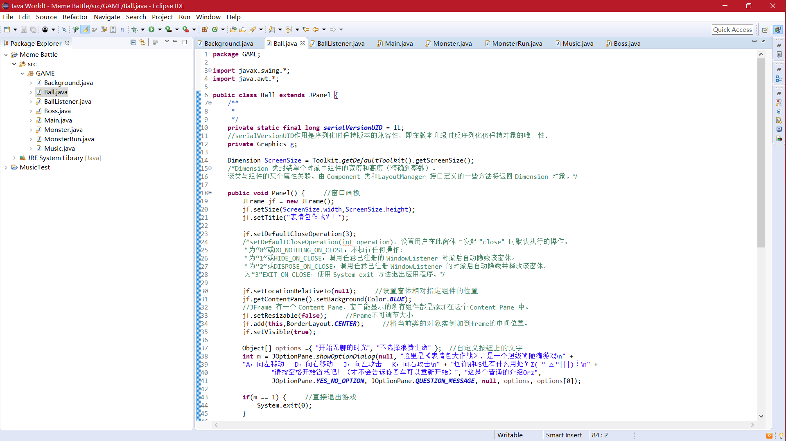

图1 代码界面


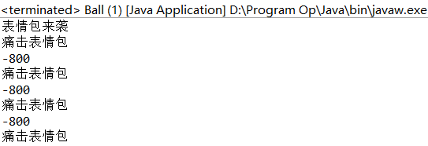

图2 返回值窗口

（表情包来袭是指线程二开始生成怪物，痛击表情包是线程输出的击中表情包提示，-800是当前背景图所在坐标）


## 六、   测试


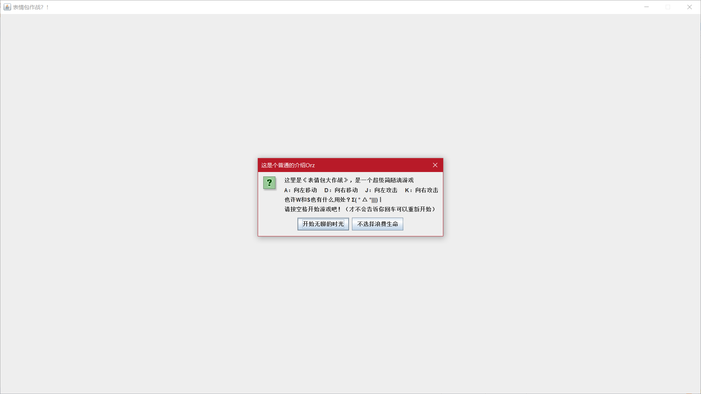

图1 游戏开始窗口


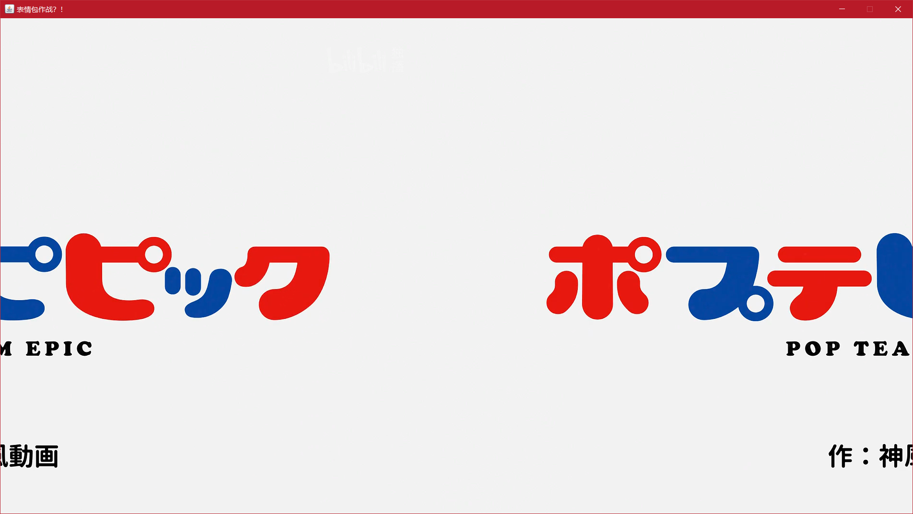

图2 游戏开始界面（未按空格开始，背景因为滚动，叠为两张）


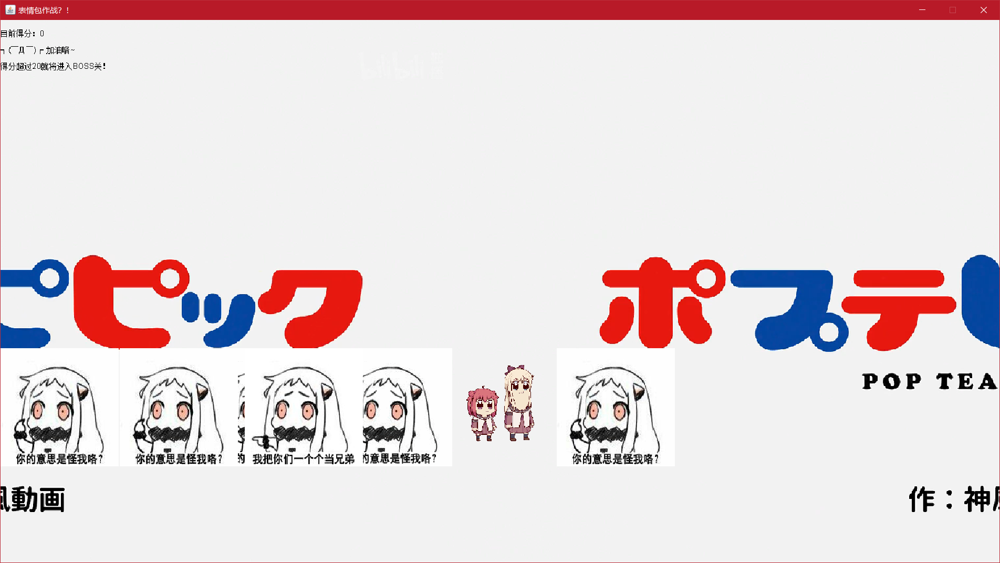

图3 游戏开始


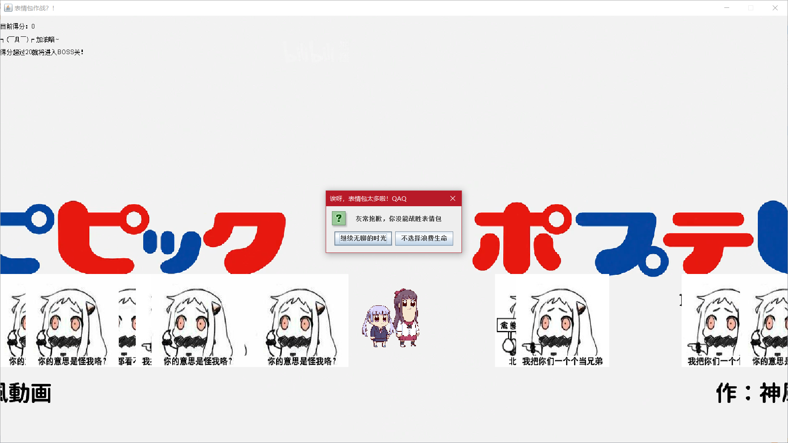

图4 未能击败表情包


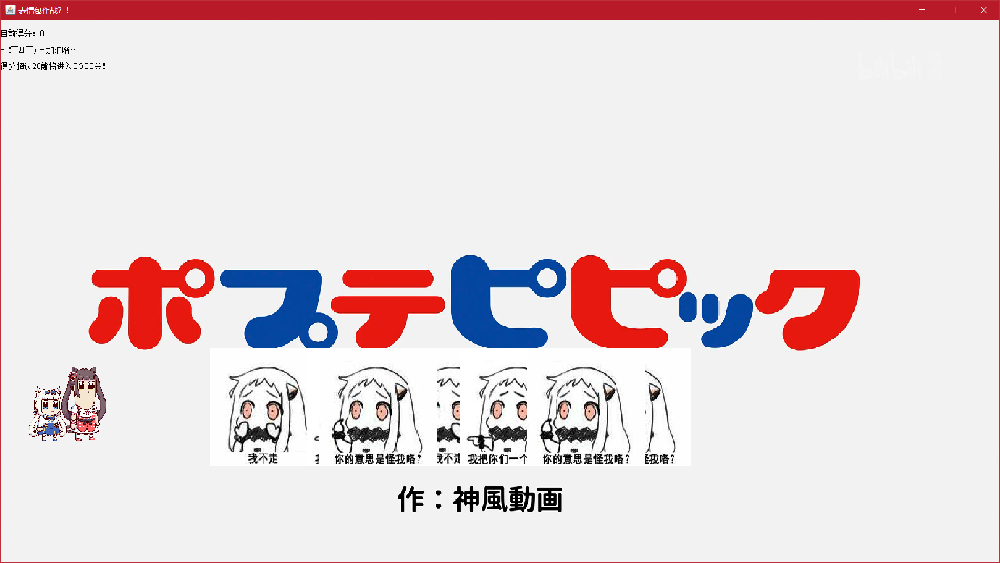

图5 背景随人物移动滚动


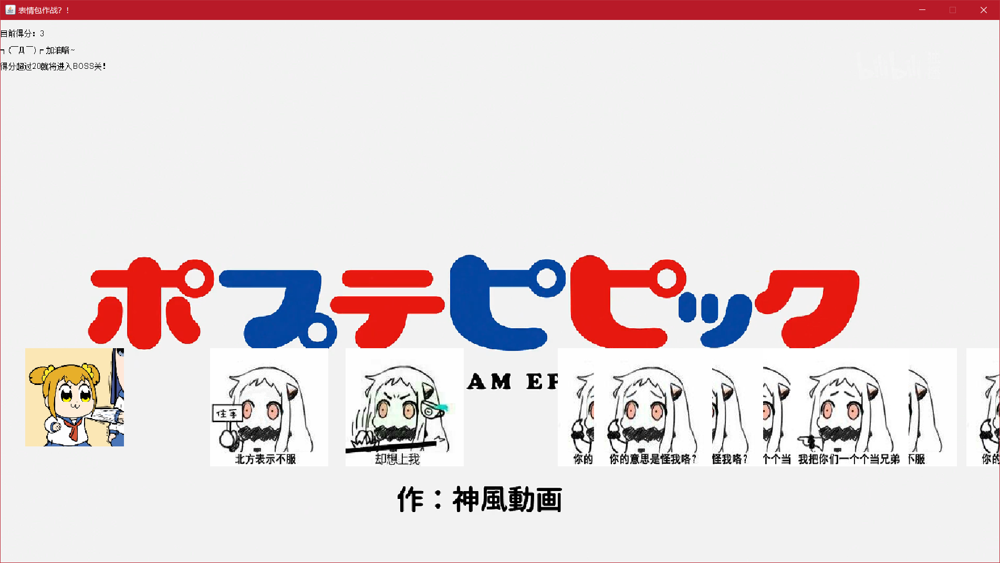

图6 人物攻击动作


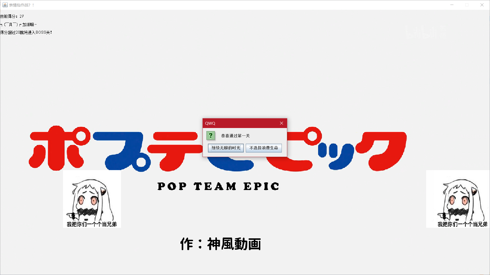

图7 通过第一关（Boss关我注释掉了，因为游戏体验有点差）

 

## 七、体会


1.java SE的版本不同会导致一些问题，一定要找到符合当前版本的库及引用方式；


2.对自定义方法get（）和set（）有了更加充分的认识，跨类获得变量或为变量赋值；


3.不同类中使用同一命名参数真的很麻烦，很容易自己都乱掉了；


4.对java的安全性有了更加深刻的认识，private指定和默认的差距是真的大；


5.数组能以类生成的实例对象为元素加入数组，这个是真的学到了；


6.监听器及其对应的处理方法有很多，每个都有细小的区别，可以利用这些区别设计功能；


7.图形界面的创建还是第一次，视觉冲击和体验都是很不同的，也是明白了现在我们所使用的各种软件的运行实现大概是怎么样的。

 

## 八、参考资料


[1] 刘志宏 向东 宿营. Java程序设计教程[M]. 航空工业出版社, 2018.2


[2] Leesire. Java基础——java类——Dimension.

https://blog.csdn.net/lee_sire/article/details/14101023. 2013.11


[3] 飘洋过海的鱼. Java_ToolKit用法.

https://www.cnblogs.com/bby2014210552/p/5953274.html. 2016.10


[4] Sun. 类java.awt.Image的使用.

https://download.oracle.com/technetwork/java/javase/6/docs/zh/api/java/awt/class-use/Image.html#java.awt.image. 2008.1


[5] Java Applet基础.

http://www.runoob.com/java/java-applet-basics.html. 2013


[6] jxqingfeng. 如何获取BufferedImage中TYPE_4BYTE_ABGR类型的值.

https://bbs.csdn.net/topics/391901749. 2016.2


[7] 荆小八. @SupperssWarnings忽略警告. 

https://www.cnblogs.com/jingzhenhua/p/5986689.html. 2016.10


[8] 网上忍者. private static final long serialVersionUID = 1L是什么意思. https://zhidao.baidu.com/question/428013630.html. 2017.6


[9] 好名字占了. JFrame中setDefaultCloseOperation的参数含义. 

https://blog.csdn.net/liujun13579/article/details/7755871. 2012.7


[10] OneCode2Word. 真正认识JFrame和getContentPane()方法.

https://blog.csdn.net/h002399/article/details/47404451. 2015.8


[11] sysustriker. ImageObserver的用法. 

https://blog.csdn.net/sysustriker/article/details/5307845. 2010.2


[12] Clannad_汐. Java消息提示框JOptionPane的使用方法. 

https://blog.csdn.net/c1481118216/article/details/51921521. 2016.7


[13] 雪残梦影. Java中的get（）和set（）方法. 

https://www.cnblogs.com/xuecanmeng/p/5165969.html. 2016.1


[14] horiway. Java中File.toURL()方法在新版本Java中应该使用什么方法？.

https://zhidao.baidu.com/question/101923217.html. 2017.11


[15] tommy__2005. 关于用java播放声音的问题之LOOP方法.

https://blog.csdn.net/tommy___2005/article/details/1648781. 2007.6


[16] 关于java imageobser的imageupdate（）类的问题. 

https://zhidao.baidu.com/question/2009477426477989988.html. 2013.9


[17] ck_2016. Java中在特定区间产生随机数.

https://www.cnblogs.com/ylz8401/p/7234687.html. 2017.7